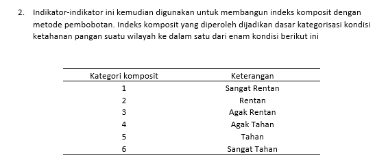

```{r echo=FALSE, message=FALSE, warning=FALSE, include=FALSE}
#                      -=( Install & Load Package Function )=-
install_load <- function (package1, ...)  {   

   # convert arguments to vector
   packages <- c(package1, ...)

   # start loop to determine if each package is installed
   for(package in packages){

       # if package is installed locally, load
       if(package %in% rownames(installed.packages()))
          do.call('library', list(package))

       # if package is not installed locally, download, then load
       else {
          install.packages(package)
          do.call("library", list(package))
       }
   } 
}
```

```{r, include=FALSE, echo=FALSE, warning=FALSE, message = FALSE}
path <- function() gsub  ( "\\\\",  "/",  readClipboard ()  )
#Copy path, Panggil function di console
#Copy r path, paste ke var yang diinginkan
```

```{r setup, include=FALSE, echo=FALSE, warning=FALSE, message = FALSE}
require("knitr")
opts_knit$set(root.dir = "C:/Users/Fathan/Documents/Obsidian Vault/2. Kuliah/Smt 5/5. Teknik Peubah Ganda")
```

\newpage

## Data input

```{r message=FALSE, warning=FALSE}
install_load('readxl')
data <- read_excel("Data FSVA 2022 -- multivariate.xlsx")
install_load('DT')
datatable(data, filter = 'top', 
          options = list(pageLength = 10))
rownames(data) <- data$Wilayah
```

# No 1.a

> Analisis komponen utama pada ke-9 indikator!

Untuk analisis nya, dapat menggunakan plot matriks korelasi maupun matriks kovarians. Matriks korelasi yang berisi nilai-nilai korelasi pada dasarnya digunakan untuk mendapatkan keeratan hubungan antar peubah yang diteliti. Nilai korelasi inilah yang nantinya akan dibandingkan dengan nilai korelasi yang diperoleh dari Analisis Komponen Utama.

```{r dpi=300, fig.height = 15, fig.width = 15, fig.align = "center", message = FALSE, warning=FALSE}
install_load('factoextra','ggcorrplot')
ggcorrplot(cor(data[,-c(1,2)]), type="lower",lab = TRUE)
```

Dari plot matriks korelasi di atas terlihat bahwa **korelasi negatif tertinggi** ialah korelasi antara indikator `Tanpa Air Bersih (%)` dengan `Lama Sekolah Perempuan (tahun)` yakni sebesar $-0.63$. Sedangkan **korelasi negatif terendah** ialah antara indikator `Lama Sekolah Perempuan (tahun)` dengan `Rasio Tenaga Kesehatan` yakni sebesar $-0.3$. Disisi lain, korelasi positif tertingginya ialah antara indikator `Kemiskinan (%)` dengan `Tanpa Air Bersih` yakni sebesar $0.56$. Sedangkan korelasi positif terendah adalah antara indikator `NCPR` degnan `Peneluaran pangan (%)` yakni sebesar $0.11$.

# No 1.b

> Berikan penjelasan berapa banyak komponen utama yang sebaiknya dipertahankan untuk menggambarkan data ini tanpa banyak keragaman data asal yang terbuang!

```{r}
pca_data <- prcomp(data[,-c(1,2)],scale=TRUE,center=TRUE)
summary(pca_data)
```

-   **Standard deviaton** merupakan akar dari akar ciri (eigenvalue). Dalam hal ini akar ciri berperan sebagai variance dari masing-masing komponen utama.

-   **Proportion of Variance** menjelaskan seberapa besar keragaman peubah asal yang dapat dijelaskan oleh masing-masing komponen utama. Semakin besar nilainya berarti semakin baik pula komponen utama tersebut untuk merepresentasikan peubah asal. Lalu pada tabel diatas, nilai terbesarnya iyalah PC3 dengan nilai $0.08838$ sedangkan nilai terkecilnya ialah PC9 dengan nilai $0.03527$.

-   **Cumulative Proportion** menjelaskan seberapa besar keragaman yang dapat dijelaskan oleh komponen utama secara kumulatif. Misalnya saja dengan menggunakan dua komponen utama saja (PC1 dan PC2), sudah bisa menjelaskan 62% keragaman dari data.

```{r dpi=300, fig.align = "center", message = FALSE, warning=FALSE}
fviz_screeplot(pca_data,geom="line")
```

Hal lain yang bisa dilakukan untuk menentukan berapa banyak komponen utama yang digunakan adalah dengan `screeplot`. Banyaknya komponen utama bisa ditentukan dengan screeplot dengan melihat di komponen utama yang mana garisnya berbentuk seperti siku (elbow). Pada gambar diatas, garis membentuk siku saat berada di komponen utama kedua (dimension kedua). Namun jika melihat pada **Cumulative Proportion** nya, Komponen Utama 1 dan Komponen Utama 2 hanya dapat menjelaskan 62% keragaman dari data saja. Dan jika melihat pada **Proportion of Variance** nya, PCA3 adalah nilai terbesarnya dengan nilai $0.08838$ . Walaupun siku yang terbentuk pada plot tidak terlalu tajam, Namun dengan 2 pertimbangan yang sudah dijelaskan. Maka banyaknya komponen utama yang digunakan sebanyak tiga (Komponen Utama 1, 2, dan 3).

# No 1.c

> Berapakah besarnya kontribusi 2 komponen utama pertama dalam menjelaskan keragaman data asal?

```{r}
pca_data <- prcomp(data[,-c(1,2)],scale=TRUE,center=TRUE)
summary(pca_data)
```

Seperti yang sudah dijelaskan sebelumnya pada no1.b.. 2 komponen utama dapat menjelaskan 62% dari keragaman data asal. Angka ini bisa dibilang besar. Ini bisa di dukung oleh plot screeplot nya.

```{r dpi=300, fig.align = "center", message = FALSE, warning=FALSE}
fviz_screeplot(pca_data,geom="line")
```

Yang mana jika kita melihat ulang, maka siku tertajam berada di angka 2.

# No 1.d

> Berikan interpretasi pada 2 komponen utama pertama!

```{r}
datatable(pca_data$rotation, filter = 'top', 
          options = list(pageLength = 10))
```

Interpretasi metode PCA dapat dilakukan dengan menggunakan vektor ciri pada masing-masing komponen utama. Semakin besar vektor ciri pada komponen utama tertentu, maka semakin besar pula kontribusi dari peubah asal untuk membangun komponen utama tersebut. Catatan lain yang perlu diperhatikan adalah nilai negatif pada vektor ciri menandakan peubah asal memberikan kontribusi yang berkembalikan pada pembentukan komponen utama. Dalam konteks vektor ciri negatif, semakin besar nilai peubah asal semakin kecil nilai pada komponen utama.

Vector ciri yang akan dinterpretasikan hanya pada PC1 dan PC2. PC1 memiliki vektor ciri yang relatif sama yaitu berkisar di 0.3 untuk semua Indikator. Vektor ciri yang relatif sama ini menandakan bahwa kontribusi peubah asal untuk membangun komponen utama ini relatif sama. Artinya nilai-nilai yang ada di PC1 (score value) dapat menggambarkan ketahanan pangan untuk semua indikator. Oleh karena itu kita dapat dapat menggunakan PC1 untuk menentukan wilayah mana yang memiliki ketahanan pangan terbaik untuk semua indikatornya.

PC2 memiliki vektor ciri yang relatif sama juga yaitu berkisar di 0.2. Vektor ciri yang relatif sama ini menandakan bahwa kontribusi peubah asal untuk membangun komponen utama ini relatif sama. Artinya nilai-nilai yang ada di PC2 (score value) dapat menggambarkan ketahanan pangan untuk semua indikator. Oleh karena itu kita dapat dapat menggunakan PC2 untuk menentukan wilayah mana yang memiliki ketahanan pangan terbaik untuk semua indikatornya.

**Note**: Interpretasi komponen utama memiliki subjektifitas yang tinggi, oleh karena itu setiap orang menginterpretasikanya berbeda.

Hal terakhir yang bisa diinterpretasikan adalah score value pada PC1 dan PC2. Score value merupakan observasi/koordinat baru pada peubah komponen utama. Dalam konteks data pelari diatas, observasinya adalah negara, sehingga kita dapat memberi insight cabang perlombaan lari dari setiap negara. Untuk melihat score value pada komponen utama dapat dilihat dengan menggunakan sintaks berikut.

```{r}
datatable(pca_data$x, filter = 'top', 
          options = list(pageLength = 10))
```

Agar lebih mudah dalam menginterpretasikan score value maka digunakaan grafik di bawah ini.

```{r dpi=300, fig.height = 15, fig.width = 15, fig.align = "center", message = FALSE, warning=FALSE}
fviz_pca_ind(pca_data,col.ind = "darkred")
```

Berdasarkan grafik score value dapat diketahui bahwa negara yang memiliki catatan ketahanan pangan terbaik untuk semua indikator adalah wilayah baris 479 (papua - puncak jaya)

```{r}
 data$Wilayah[479]
```

# No 2.a



> Lakukan analisis MANOVA untuk membandingkan keenam kategori komposit berdasarkan 9 indikator ketahanan pangan. Gunakan taraf nyata 5%. Apakah kesimpulannya?

```{r}
install_load('car')
model <- manova(cbind(NCPR, `Kemiskinan (%)`, `Pengeluaran Pangan (%)`, 
                      `Tanpa Listrik (%)`, 
                     `Tanpa Air Bersih (%)`, `Lama Sekolah Perempuan (tahun)`, 
                     `Rasio Tenaga Kesehatan`, `Angka Harapan Hidup (tahun)`, `Stunting (%)`) ~ `Kategori Komposit`, data=data)

summary(model)
```

```{r}
summary.aov(model, intercept = FALSE)
```

Hasil dari analisis MANOVA menunjukkan bahwa terdapat perbedaan yang signifikan antara keenam kategori komposit (Kategori Komposit) berdasarkan 9 indikator ketahanan pangan yang telah dianalisis. Ini dapat dilihat dari nilai p-value yang sangat kecil (kurang dari tingkat signifikansi 0.05) pada setiap variabel respons.

Berikut adalah interpretasi untuk setiap variabel respons:

1.  **NCPR**:

    -   Terdapat perbedaan yang signifikan antara kategori komposit dalam hal Nilai Konsumsi Per Kapita Rata-rata (NCPR).

    -   Perbedaan ini sangat signifikan dengan nilai p-value yang sangat kecil (\< 0.001).

2.  **Kemiskinan (%)**:

    -   Terdapat perbedaan yang signifikan antara kategori komposit dalam hal tingkat kemiskinan.

    -   Perbedaan ini sangat signifikan dengan nilai p-value yang sangat kecil (\< 0.001).

3.  **Pengeluaran Pangan (%)**:

    -   Terdapat perbedaan yang signifikan antara kategori komposit dalam hal persentase pengeluaran untuk pangan.

    -   Perbedaan ini sangat signifikan dengan nilai p-value yang sangat kecil (\< 0.001).

4.  **Tanpa Listrik (%)**:

    -   Terdapat perbedaan yang signifikan antara kategori komposit dalam hal persentase rumah tangga tanpa listrik.

    -   Perbedaan ini sangat signifikan dengan nilai p-value yang sangat kecil (\< 0.001).

5.  **Tanpa Air Bersih (%)**:

    -   Terdapat perbedaan yang signifikan antara kategori komposit dalam hal persentase rumah tangga tanpa akses air bersih.

    -   Perbedaan ini sangat signifikan dengan nilai p-value yang sangat kecil (\< 0.001).

6.  **Lama Sekolah Perempuan (tahun)**:

    -   Terdapat perbedaan yang signifikan antara kategori komposit dalam hal lamanya pendidikan perempuan.

    -   Perbedaan ini sangat signifikan dengan nilai p-value yang sangat kecil (\< 0.001).

7.  **Rasio Tenaga Kesehatan**:

    -   Terdapat perbedaan yang signifikan antara kategori komposit dalam hal rasio tenaga kesehatan.

    -   Perbedaan ini sangat signifikan dengan nilai p-value yang sangat kecil (\< 0.001).

8.  **Angka Harapan Hidup (tahun)**:

    -   Terdapat perbedaan yang signifikan antara kategori komposit dalam hal angka harapan hidup.

    -   Perbedaan ini sangat signifikan dengan nilai p-value yang sangat kecil (\< 0.001).

9.  **Stunting (%)**:

    -   Terdapat perbedaan yang signifikan antara kategori komposit dalam hal persentase stunting (kondisi gizi buruk pada anak).

    -   Perbedaan ini sangat signifikan dengan nilai p-value yang sangat kecil (\< 0.001).

Kesimpulannya, berdasarkan analisis MANOVA, dapat disimpulkan bahwa ada perbedaan yang signifikan antara kategori komposit dalam semua indikator ketahanan pangan yang telah dianalisis. Hal ini menunjukkan bahwa faktor kategori komposit memiliki pengaruh yang signifikan terhadap berbagai aspek ketahanan pangan di wilayah tersebut.

# No 2.b

> Susunlah selang kepercayaan simultan 95% untuk menentukan kategori yang memiliki perbedaan rataan yang signifikan.

# No 2.c

> Apakah asumsi MANOVA dapat dipenuhi oleh data tersebut?
